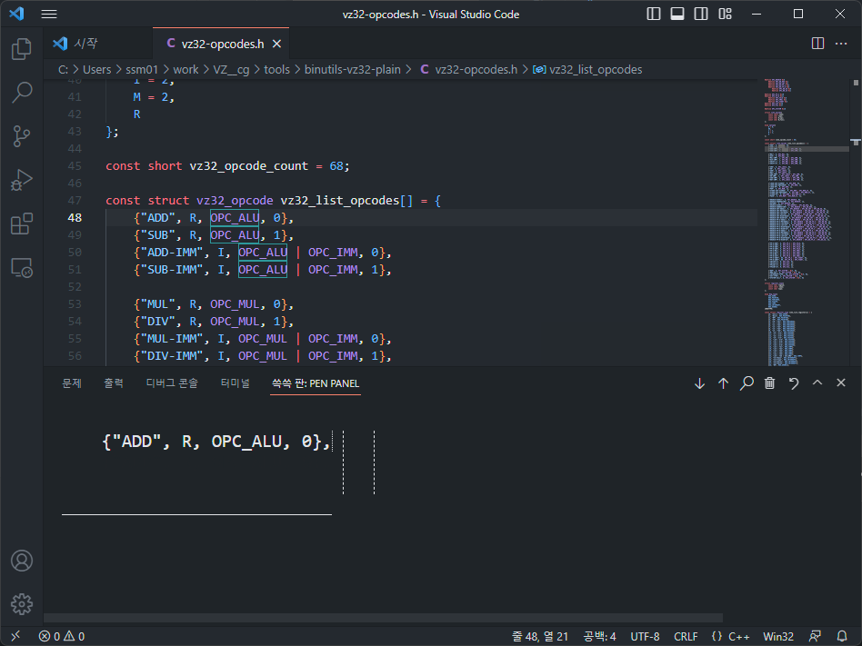
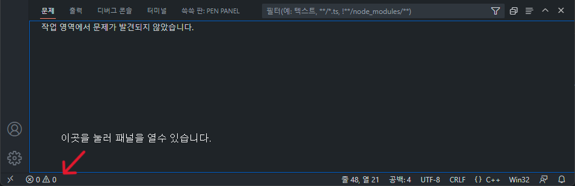
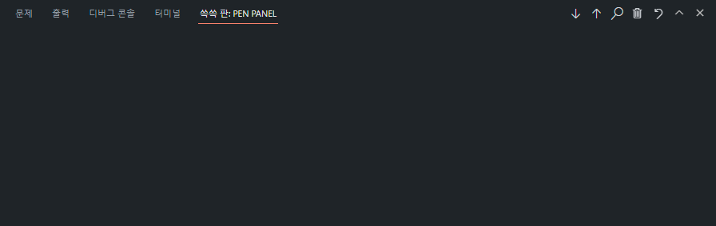
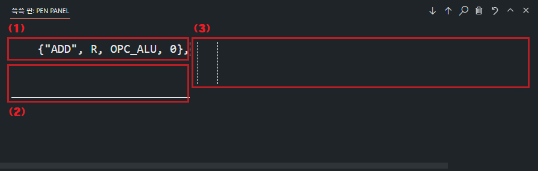

# 쓱쓱이 - VSCode용 손글씨 입력기
**쓱쓱이는 손글씨로 코드를 입력하게 해주는 VSCode 확장 프로그램입니다!**

## 어떤 환경에서 동작 하나요?
VSCode 위라면 어디서든 동작하게 구현중에 있습니다!
### Windows 10 / 11 기반 운영체제 태블릿
스타일러스가 호버를 지원하는 경우 완벽하게 지원하고 있습니다! 
스타일러스로 인식하지 않고 단순 터치로 지원하는 경우 **mouse**로 세팅하셔야 합니다.
### Android 태블릿
S-Pen등 갤럭시 계열은 호버 기능을 포함하여 모든 기능을 지원합니다! 
스타일러스로 인식하지 않고 단순 터치로 지원하는 경우 **mouse**로 세팅하셔야 합니다.
### iPad
M2탑재 iPad Pro를 제외하고는, 호버 기능을 지원하지 않고 다른 기능을 지원합니다! 
기본으로는 **Non-hover Stylus**로 사용하고 M2칩 이상 iPad는 **stylus**로 세팅하시면 되겠습니다.

## 기능
**쓱쓱이는 손코딩을 위한 여러가지를 지원합니다!**

(아래 모든 사진은 이해를 위해 Non-hover Stylus 모드로 설명하겠습니다.)

### 실행
패널을 열어주세요. (에러나 터미널을 열수 있는 창입니다.) 

가장 우측에 **쓱쓱 판:PEN PANEL**이라는 메뉴가 생겼습니다. 들어가줍시다.

쓱쓱이가 실행 되었습니다. 
현재는 빈 창인데, 이제 편집할 수 있는 편집모드로 들어가볼까요?

### 편집 모드
상단 텍스트 에디터에서 원하는 라인을 클릭합시다. 

해당 라인에 맞게 텍스트가 나타납니다!

편집모드는 세 부분으로 나누어 집니다. 
1. 글자 선택 부분
2. 글자 앞에 추가 모드
3. 글 꼬리에 추가 모드

### 글자 선택

## 사용된 외부 라이브려리, 리소스
LICENSE.md 참조.