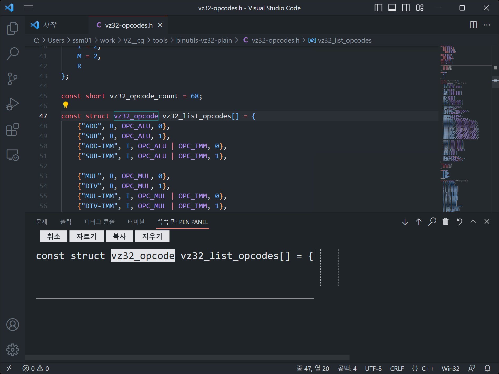

# 쓱쓱이 - VSCode용 손글씨 입력기
**쓱쓱이는 손글씨로 코드를 입력하게 해주는 VSCode 확장 프로그램입니다!**

## 어떤 환경에서 동작 하나요?
VSCode 위라면 어디서든 동작하게 구현중에 있습니다!
### Windows 10 / 11 기반 운영체제 태블릿
스타일러스가 호버를 지원하는 경우 완벽하게 지원하고 있습니다! 
스타일러스로 인식하지 않고 단순 터치로 지원하는 경우 **mouse**로 세팅하셔야 합니다.
### Android 태블릿
S-Pen등 갤럭시 계열은 호버 기능을 포함하여 모든 기능을 지원합니다! 
스타일러스로 인식하지 않고 단순 터치로 지원하는 경우 **mouse**로 세팅하셔야 합니다.
### iPad
M2탑재 iPad Pro를 제외하고는, 호버 기능을 지원하지 않고 다른 기능을 지원합니다! 
기본으로는 **Non-hover Stylus**로 사용하고 M2칩 이상 iPad는 **stylus**로 세팅하시면 되겠습니다.

세팅에 관한 내용은 아래 **설정** 문단을 참조하세요.

## 기능과 사용법
**쓱쓱이는 손코딩을 위한 여러가지를 지원합니다!**

(아래 모든 사진은 이해를 위해 Non-hover Stylus 세팅으로 설명하겠습니다.) 
(다른 세팅에서는 호버하는 경우에 경계선이 나타납니다.)

### 실행
패널을 열어주세요. (에러나 터미널을 열수 있는 창입니다.) 

가장 우측에 **쓱쓱 판:PEN PANEL**이라는 메뉴가 생겼습니다. 들어가줍시다.

쓱쓱이가 실행 되었습니다. 
현재는 빈 창인데, 이제 편집할 수 있는 편집모드로 들어가볼까요?

### 편집 모드
상단 텍스트 에디터에서 원하는 라인을 클릭합시다. 

해당 라인에 맞게 텍스트가 나타납니다!

현재 상태를 편집모드라고 합니다.
 
편집모드는 세 부분으로 나누어 집니다. 
1. 글자 선택 부분
2. 글자 앞에 추가 모드
3. 글 꼬리에 추가 모드

#### 글자 선택
원하는 글자 범위를 선택할 수 있습니다! 
쓱쓱이 위에 나타난 글자를 누르면 글자를 선택할 수 있습니다.

<위 그림은 v 를 누르고 그다음 e를 누른 상황입니다.>

한글자 선택도 가능하며, 선택된 글자를 상단 버튼을 눌러 자르기, 복사, 지우기를 할 수 있습니다. 
취소를 눌러주시면 선택이 취소되고 편집모드 초기 화면으로 이동합니다.

#### 글자 앞에 추가
원하는 글자 앞에 글을 추가할 수 있습니다! 
편집을 원하는 글자 아래를 누르면 글을 쓸 수 있는 캔버스가 나타납니다. 

<위 그림은 글자 R 아래를 누른 상황입니다.>

캔버스에 원하는 글자를 입력합니다.

상단 버튼을 통해 해당 위치에 공백, 탭 추가도 가능합니다. 
중단을 눌러주시면 편집모드 초기 화면으로 이동합니다.

펜을 떼고 설정된 시간(기본값 2초)이 지나면 글자를 인식하여 텍스트로 변환합니다.

#### 글 꼬리에 추가
라인 후미에 텍스트를 추가할 수 있습니다! 
단순 텍스트 추가 뿐 아니라, 공백과 탭을 추가하여 작성할 수 있습니다. 

텍스트를 입력하기 위해서는 위치를 클릭 하면 캔버스가 나타납니다.

위치는 세 구획으로 구분 됩니다.
1. 바로 뒤 입력
2. 공백 추가 후 입력
3. 탭 추가 후 입력 (VSCode에서 설정된 tab size만큼 공백이 추가됩니다.)

캔버스에 원하는 글자를 입력합니다.

상단 버튼을 통해 해당 위치에 공백, 탭 추가도 가능합니다. 
중단을 눌러주시면 편집모드 초기 화면으로 이동합니다.

글자 앞에 추가 모드와 동일하게 펜을 떼고 설정된 시간(기본값 2초)이 지나면 글자를 인식하여 텍스트로 변환합니다.

### 단축 버튼
손코딩을 편하게 하기 위해 쓱쓱이 우상단에 여러가지 단축 버튼이 있습니다!

 
왼쪽부터 알아봅시다.
1. 하단에 비어있는 라인 추가
2. 상단에 비어있는 라인 추가
3. 인텔리센스 추천 창(코드 자동완성 목록 창) 띄우기
4. 라인 지우기
5. 실행 취소
6. 패널 창 확장 (VSCode 기본기능)
7. 패널 창 닫기 (VSCode 기본기능)

## 설정
쓱쓱이는 사용환경에 따라 커스텀을 할 수 있는 여러가지 설정 항목이 존재합니다. 
쓱쓱이의 설정이 필요한 경우 VSCode의 **설정**에서 SseukSseuk-E를 검색하거나, 좌측 목록에서 **확장->SseukSseuk-E**로 설정 항목을 찾을 수 있습니다.
 
쓱쓱이 설정창에는 3가지 요소가 있습니다.

### Char Size
텍스트 크기입니다. 편집모드 진입시 쓱쓱이에 나타난 글자 크기를 조절할 수 있습니다. 
기본값: 18

### Input Delay Time
캔버스에서 펜이 떨어진 이후 인식을 시작하는 지연시간입니다. 단위는 ms(1/1000초)입니다. 
기본값: 2000

### Stylus Type
시스템에서 인식하는 스타일러스 타입을 지정하는 부분입니다. 
선택지는 아래와 같습니다.
1. (비어 있음) - 설정되지 않은 경우입니다. mouse와 특성은 같습니다. 베타버전에 튜토리얼이 추가될 예정인데 초기화 버튼과 동일한 기능을 하는 부분이 될 예정입니다.
2. mouse - 시스템이 스타일러스를 따로 인식하지 않는 경우, 혹은 굳이 마우스로 하실분이라면 설정하시면 되겠습니다.
3. stylus - 시스템이 호버를 지원하는 스타일러스를 인식하는 경우 사용하시면 되겠습니다.
4. Non-hover Stylus - 시스템이 호버를 지원하지 않는 스타일러스를 인식하는 경우 사용하시면 되겠습니다. **(M2칩 이하의 Apple Pencil을 사용하는 iPad에서는 무조건 이것으로 설정하세요!)**

## 사용된 외부 라이브려리, 리소스
LICENSE.md 참조. 참고로 아직 이 프로젝트의 라이선스는 결정되지 않았습니다. 딱히 그런걸 추구할 생각도 없고.